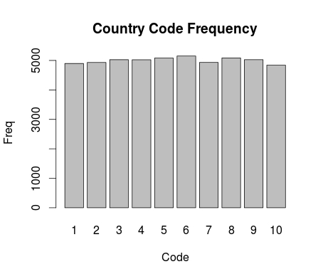
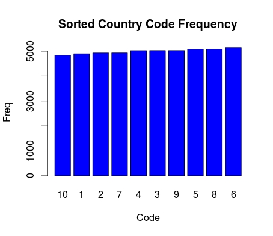

# Project 2 document

### Query 5
the command line:
>hadoop jar  /usr/share/hadoop/contrib/streaming/hadoop-streaming-1.2.1.jar \   
>    -input input/Transactions  -output out/py \   
>    -reducer Q5reducer.py -mapper Q5mapper.py \   
>    -file Customers -file Q5reducer.py -file Q5mapper.py

### Query 6
##### unsorted plot:  

##### sorted plot:  

