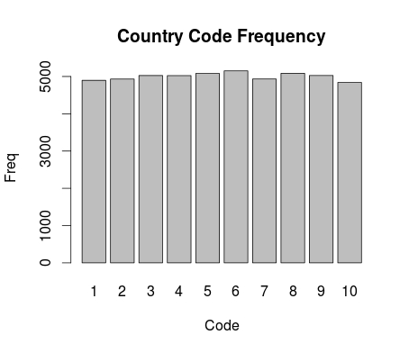
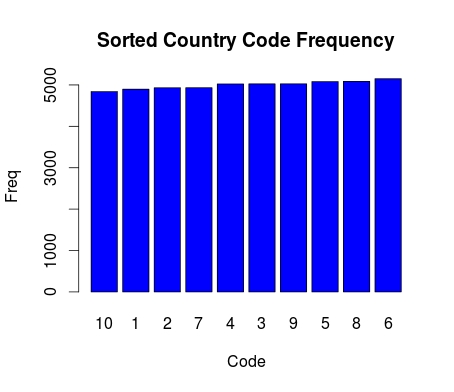

## Project 2 document
### First to load datasets into Pig Storage and give the column names
CUSTS = LOAD '/user/hadoop/data/Customers' USING PigStorage(',') AS (custID:INT, custName:CHARARRAY, age:INT, countryCode:INT, salary:FLOAT);
TRANS = LOAD '/user/hadoop/data/Transactions' USING PigStorage(',') AS (transID:INT, custID:INT, transTotal:FLOAT, transNumItems:INT, transDesc:CHARARRAY);

### Qeury1
#### Firstly group by transaction dataset by custID column. Secondly, do the count and sum function on grouped dataset
Q1_gp = GROUP TRANS BY custID;
DESCRIBE Q1_gp;
Q1 = FOREACH Q1_gp GENERATE group, COUNT(TRANS.transID), SUM(TRANS.transTotal);
STORE Q1 INTO '/user/hadoop/output/project2/q1';

# Query2
# Firstly, join Customers and Transactions by custID
# Secondly, group by the new joined dataset by custID
# Thirdly, do the statistics operations on the grouped dataset
Q2_join = JOIN TRANS BY custID, CUSTS BY custID;
Q2_group = GROUP Q2_join BY CUSTS::custID;
Q2 = FOREACH Q2_group GENERATE group, Q2_join.CUSTS::custName, Q2_join.CUSTS::salary, COUNT(Q2_join.TRANS::transID), SUM(Q2_join.TRANS::transTotal), MIN(Q2_join.TRANS::transNumItems);
STORE Q2 INTO '/user/hadoop/output/project2/q2';

# Query3
# Firstly, join Customers and Transactions by custID
# Secondly, group the new joined dataset by custID
# Thirdly, do the statistics operations on the new grouped dataset
Q3_join = JOIN TRANS BY custID, CUSTS BY custID;
Q3_group = GROUP Q3_join BY CUSTS::countryCode;
Q3 = FOREACH Q3_group GENERATE group, COUNT(Q3_join.CUSTS::custID), MIN(Q3_join.TRANS::transTotal), MAX(Q3_join.TRANS::transTotal);
STORE Q3 INTO '/user/hadoop/output/project2/q3';

# Query4
# Firstly, join the two datasets
# Secondly, group the two dataset by custID
# Thirdly, do the statistics operations on new grouped dataset
# Fourthly, sort the result from last step in ascending
# Fifthly, select the first item of the sorting list

Q4_join = JOIN TRANS BY custID, CUSTS BY custID;
Q4_group = GROUP Q4_join BY CUSTS::custID;
Q41 = FOREACH Q4_group GENERATE Q4_join.CUSTS::custName, COUNT(Q4_join.TRANS::transID) AS transNum;
Q42 = ORDER Q41 BY transNum;
Q43 = LIMIT Q42 1;
STORE Q43 INTO '/user/hadoop/output/project2/q4';

### Query 5
####!/usr/bin/env python

'''
hadoop jar  /usr/share/hadoop/contrib/streaming/hadoop-streaming-1.2.1.jar -input input/Transactions  -output out/py -reducer Q5reducer.py -mapper Q5mapper.py -file Customers -file Q5reducer.py -file Q5mapper.py
'''

####map side join first
import sys

customers = {}
with open('Customers','rb') as f:
for line in f:
record = line.strip().split(',')
if int(record[3].strip())==5:
customers[int(record[0])]=record[1]
for line in sys.stdin:
record = line.split(',')
cid = int(record[1].strip())
if cid in customers.keys():
print "%d,%s,%d" % (cid,customers[cid],1)
the command line:
>hadoop jar  /usr/share/hadoop/contrib/streaming/hadoop-streaming-1.2.1.jar \   
>    -input input/Transactions  -output out/py \   
>    -reducer Q5reducer.py -mapper Q5mapper.py \   
>    -file Customers -file Q5reducer.py -file Q5mapper.py

### Query 6
##### unsorted plot:  

##### sorted plot:  

